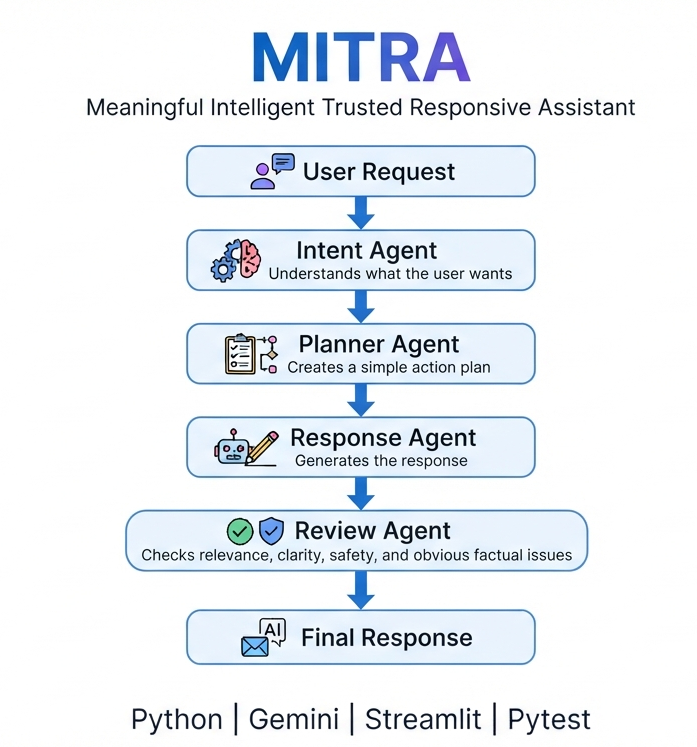

# 🤖 MITRA

**Meaningful Intelligent Trusted Responsive Assistant**

MITRA is a simple GenAI assistant built with Python, Gemini, and Streamlit.

It uses multiple AI agents to understand a user's request, create a plan, generate a response, and review the response before showing it.

## 🏗️ Architecture



## ✨ How MITRA Works

```text
User
 ↓
Intent Agent
 ↓
Planner Agent
 ↓
Response Agent
 ↓
Review Agent
 ↓
Final Response
```

## 🚀 Features

* 🧠 Understands user intent
* 🗺️ Creates a simple action plan
* ✍️ Generates a helpful response
* 🛡️ Reviews the generated response
* 💬 Simple Streamlit interface
* 🧪 Basic automated tests
* 🔐 API key stored using environment variables

## 🛠️ Tech Stack

* Python
* Google Gemini API
* Google GenAI SDK
* Streamlit
* Pytest

## ⚙️ Setup

Clone the repository and open the project folder.

Create a virtual environment:

```bash
python -m venv .venv
```

Activate it and install dependencies:

```bash
pip install -r requirements.txt
```

Create a `.env` file:

```text
GOOGLE_API_KEY=your_gemini_api_key_here
```

Run MITRA:

```bash
streamlit run app.py
```

## 🧪 Run Tests

```bash
pytest
```

## 📌 Project Status

**MITRA v1** is a simple proof-of-concept demonstrating a multi-agent GenAI workflow.

More capabilities can be added in future versions.

## 📄 License

This project is open source and intended for learning and experimentation.
